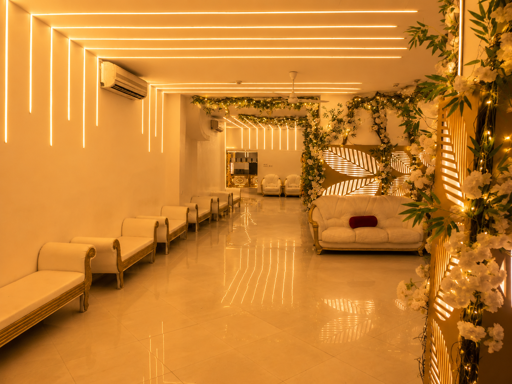
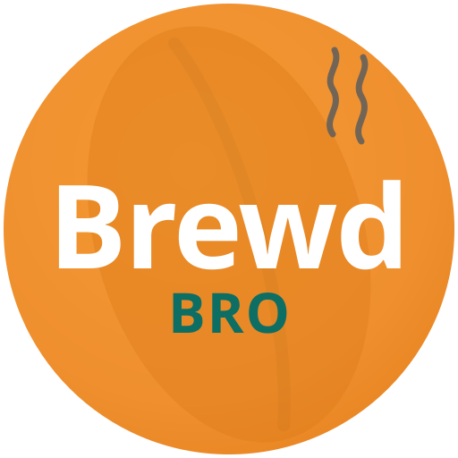

# Website Projects


A portfolio monorepo containing two independent, production-quality full-stack web applications — a hospitality/events marketing site and a 3D-driven D2C e-commerce storefront. Both are built with **Next.js (App Router)** and **TypeScript**, and can be run, built, and deployed independently of one another.

<p align="center">
  
  
</p>

---

## Projects

### 🏛️ [The Banquet](apps/banquet) — Event Venue Marketing Site

A luxury banquet hall's marketing and lead-generation website for **the Banquet by A.B.Corp**, a Kolkata-based event venue with 100+ weddings and 200+ events hosted (4.5★, 679 Google reviews).

- **Venue showcase** — Ground Floor and Heritage Floor listings with capacity, pricing, and photo galleries
- **Signature venues, celebrations, and legacy** pages telling the brand story
- **Gallery** of real venue photography (chandeliers, floral corridors, mandap staging, rooftop terrace)
- **WhatsApp-first inquiry flow** — prefilled booking messages routed straight to the owner
- **Scroll-reveal animations** via Framer Motion, floating call-to-action, fully responsive
- Deployable as a static export (Netlify config included)

**Stack:** Next.js 14 · React 18 · TypeScript · Tailwind CSS · Framer Motion

### ☕ [BrewdBro](apps/brewdbro) — 3D D2C Storefront

A premium, mobile-first e-commerce storefront for **BrewdBro**, an instant coffee premix + reusable glass tumbler brand — built to function as a real store with a live 3D product experience.

- **Live 3D hero** — an interactive glass tumbler rendered with React Three Fiber, finish-swapping on tap
- **Full shop flow** — filterable catalogue → product page with 3D viewer & combo upsell → cart → checkout → success
- **Persistent cart** via Zustand, free-shipping threshold, campus-pickup option
- **Demo checkout** — a realistic Razorpay-style UPI payment sheet (see [`apps/brewdbro/README.md`](apps/brewdbro/README.md) for going live with real payments)
- **Our Story** founder narrative page

**Stack:** Next.js 16 · React 19 · TypeScript · Tailwind CSS v4 · React Three Fiber + drei · Framer Motion · Zustand

---

## Repository structure

```
Website_Projects/
├── apps/
│   ├── banquet/        # The Banquet — venue marketing site
│   │   ├── src/app/           # Home, celebrations, signature-venues, gallery, legacy, connect
│   │   ├── src/components/    # Navigation, Footer, FloatingCTA, ScrollReveal
│   │   └── public/images/     # Venue photography
│   └── brewdbro/        # BrewdBro — 3D D2C storefront
│       ├── src/app/           # Home, shop, product/[slug], cart, checkout, success, our-story
│       ├── src/components/    # Nav, Footer, product cards, 3D viewers (three/)
│       └── src/lib/           # Cart state, product catalogue, formatting helpers
└── README.md            # you are here
```

## Tech stack

| | The Banquet | BrewdBro |
|---|---|---|
| Framework | Next.js 14 (App Router) | Next.js 16 (App Router, Turbopack) |
| UI | React 18 + TypeScript | React 19 + TypeScript |
| Styling | Tailwind CSS 3 | Tailwind CSS 4 |
| Animation | Framer Motion | Framer Motion |
| 3D | — | React Three Fiber + drei (Three.js) |
| State | — | Zustand |
| Deployment | Vercel / Netlify (static export) | Vercel |

## Getting started

Each project is self-contained with its own dependencies and lockfile.

```bash
# The Banquet
cd apps/banquet
npm install
npm run dev      # http://localhost:3000

# BrewdBro
cd apps/brewdbro
npm install
npm run dev      # http://localhost:3000
```

Production build for either project:

```bash
npm run build && npm start
```

## Author

**Shreyas Bhardwaj**
